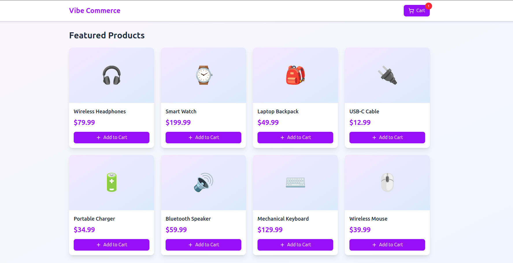
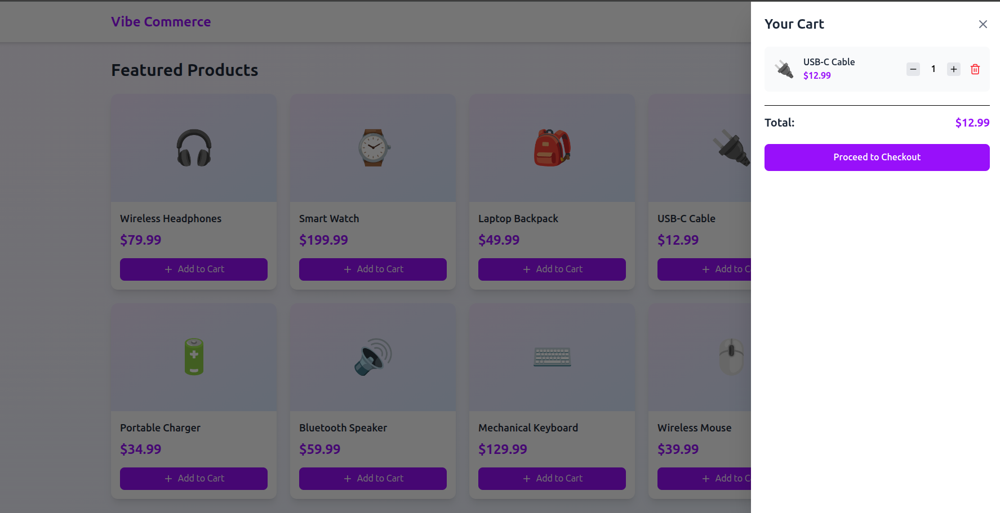
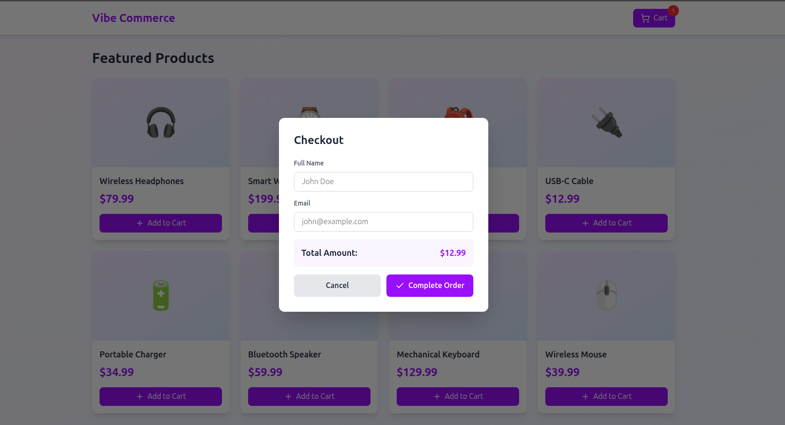
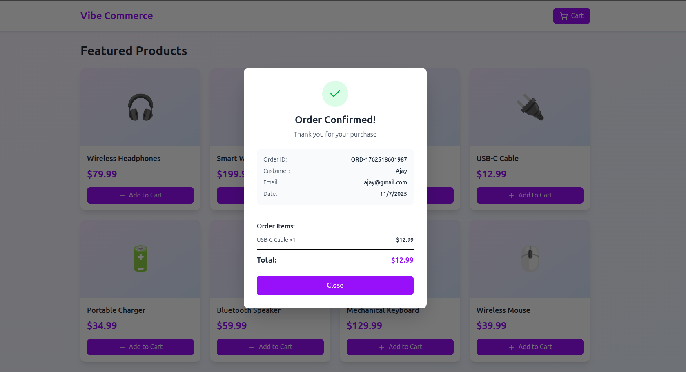

# 🛒 Vibe Commerce Mock E-Com Cart

## 🎯 Overview

This repository contains the solution for the Vibe Commerce Full Stack Coding Assignment: **Mock E-Com Cart**. The application simulates a basic e-commerce shopping experience, allowing users to browse products, add/remove items from a cart, view the cart total, and complete a mock checkout process.

The assignment demonstrates proficiency in building a complete **full-stack application**, focusing on **RESTful API** design, **frontend state management**, and **database integration** using a modern technology stack.

-----

## 🛠️ Tech Stack

| Component | Technology | Description |
| :--- | :--- | :--- |
| **Frontend** | **React** | Component-based library for building the user interface. |
| **Styling** | **Tailwind CSS** | Utility-first CSS framework for rapid and **responsive** UI development. |
| **Backend** | **Node.js** with **Express** | Minimal and flexible server-side environment for handling APIs. |
| **Database** | **MongoDB** | NoSQL database for persistent storage of product catalog and cart data. |

-----

## ⚙️ Setup and Installation

Follow these steps to get the application running locally:

### 1\. Prerequisites

  * **Node.js** (LTS version recommended)
  * **npm** or **Yarn**
  * **MongoDB** running locally or a **MongoDB Atlas** connection string.

### 2\.Setup (`mock-e-com-cart-server/` directory)

1.  Navigate to the backend directory:
    ```bash
    cd mock-e-com-cart-server
    ```
2.  Install dependencies:
    ```bash
    npm install
    ```
3.  Configure your database connection string and any necessary environment variables (e.g., server port, `MONGO_URI`) in a **`.env`** file in the root of the backend directory.
4.  Start the backend server:
    ```bash
    npm start
    ```
    The server will typically run on **http://localhost:3000** (or the port specified in your configuration).

-----

## 💻 Backend API Endpoints

The following **RESTful APIs** are exposed by the Node/Express backend and interact with the MongoDB database:

| Method | Endpoint | Description |
| :--- | :--- | :--- |
| **GET** | `/api/products` | Retrieve the list of all mock products (id, name, price). |
| **GET** | `/api/cart` | Retrieve the current cart items and the calculated total. |
| **POST** | `/api/cart` | Add a specific product/quantity to the cart (requires `{productId, qty}`). |
| **DELETE** | `/api/cart/:id` | Remove a specific item from the cart using its **Cart Item ID**. |
| **POST** | `/api/checkout` | Simulate the checkout process (requires user details). Clears cart and generates a mock receipt. |

-----


## 📸 Screenshots

### 1\. Home


### 2\. Cart


### 3\. Check Out



### 4\. Order Confirmed 


